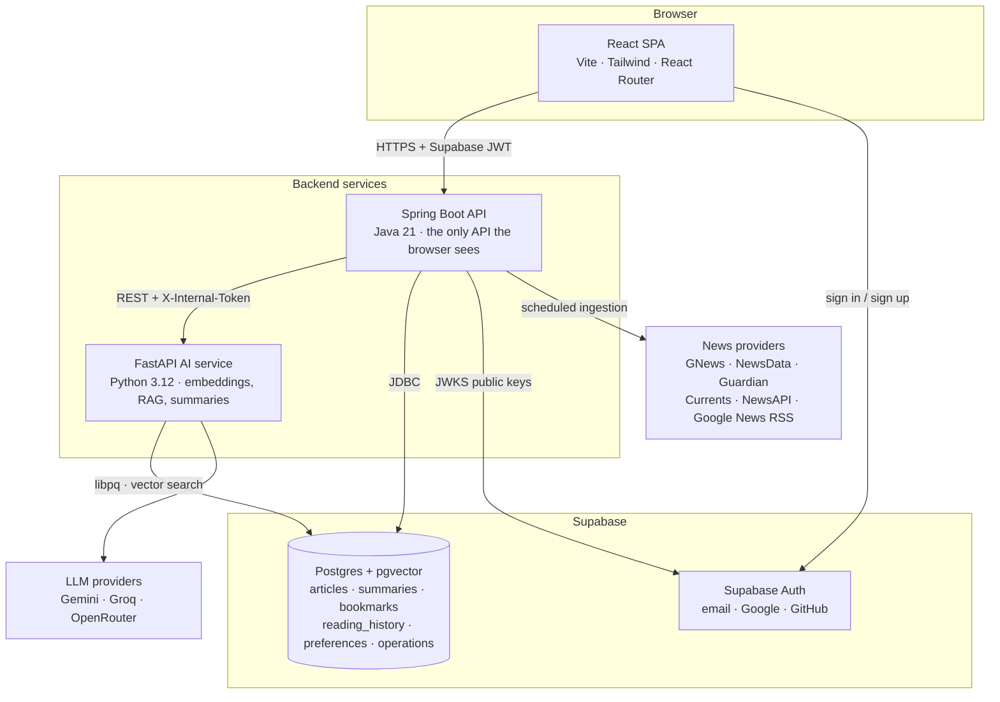
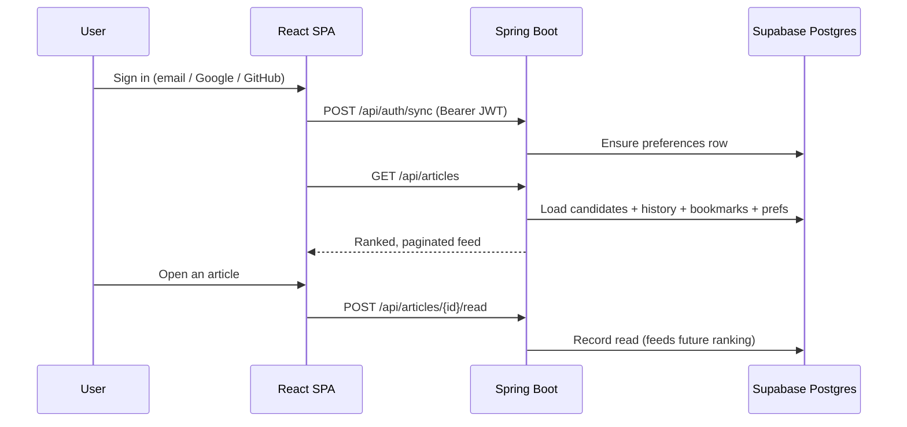
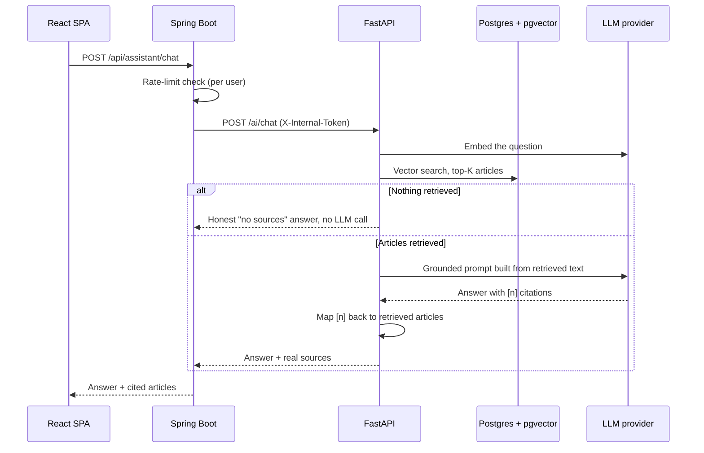
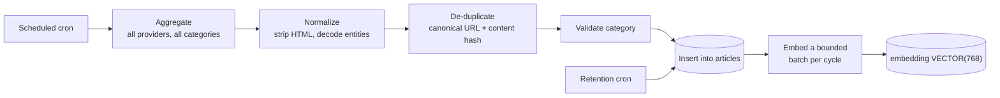

# NIA — Personalized News Intelligence Assistant

A full-stack, AI-augmented news reader. NIA continuously aggregates articles from
several free news providers, de-duplicates them across providers, categorizes and
stores them, then serves a **personalized feed** plus on-demand **AI summaries**,
**semantic search**, and a **retrieval-grounded assistant that cites the articles
it used**.

It is built as three small services — a React SPA, a Spring Boot API, and a
FastAPI AI service — over a single Supabase Postgres database with `pgvector`.
No message broker, no separate vector database, no Kubernetes.

**Live demo:** https://nia-news-intelligence-assistant.vercel.app
*(hosted on free tiers — the API sleeps when idle, so the first request after a
quiet period can take up to a minute to wake up.)*

---

## Table of contents

- [Key features](#key-features)
- [System architecture](#system-architecture)
- [Application workflow](#application-workflow)
- [Tech stack](#tech-stack)
- [Project structure](#project-structure)
- [Prerequisites](#prerequisites)
- [Installation](#installation)
- [Environment variables](#environment-variables)
- [Running the project](#running-the-project)
- [Running with Docker](#running-with-docker)
- [Tests](#tests)
- [API reference](#api-reference)
- [Database](#database)
- [Scheduled jobs](#scheduled-jobs)
- [Deployment](#deployment)
- [Credits](#credits)

---

## Key features

**Reading**

- **Personalized feed** — transparent, rule-based ranking over the recent article
  pool: recency, favourite categories, reading interest, and bookmark-source
  affinity, with configurable weights. No opaque ML model.
- **Nine categories** — Technology, Business, World, India, Science, Sports,
  Health, Entertainment, Politics.
- **Trending** — the most-read articles of the last 24 hours, optionally scoped
  to one category.
- **Bookmarks** and **reading history**, both user-scoped and RLS-protected.
- **Preferences** — favourite categories, languages, and countries, which feed
  straight back into feed ranking.

**Search**

- **Keyword search** over titles and descriptions.
- **Semantic search** — the query is embedded and matched against article vectors
  with a pgvector cosine search over an HNSW index. Falls back to keyword search
  automatically if the AI service or embedding provider is unavailable.

**AI**

- **On-demand summaries** in two lengths (short / detailed), cached per
  `(article, length)` in the database so the same summary is never paid for twice.
- **RAG assistant** — the question is embedded, the top-K articles are retrieved
  from Postgres, and a grounded prompt is sent to the LLM. **Sources come from the
  retrieval step, never from URLs the model wrote**, and citations the model emits
  are mapped back to real retrieved articles; unmapped ones are dropped. Empty
  retrieval short-circuits before an LLM call is made at all.
- **Multi-provider routing with fallback** — each AI task (chat, summary,
  classification) is routed to a configured provider and falls through a
  configurable fallback chain on transient, provider-side failures only. A
  malformed request is never retried against another provider.

**Ingestion**

- **Six news providers** behind one `NewsProvider` interface — GNews, NewsData,
  The Guardian, Currents, NewsAPI, and Google News RSS — queried in a configurable
  priority order. One provider failing never stops the others.
- **Cross-provider de-duplication** by canonical URL *and* a source-independent
  content fingerprint (normalized title + UTC day), so the same story syndicated
  by four providers is stored once.
- **Rule-based category validation** so articles land in the category a reader
  would expect.
- **Automatic retention sweep** deletes stale articles unless someone bookmarked
  or read them — this is what keeps the database inside a free Supabase plan.
- **Manual, rate-limited refresh** that runs as a tracked background operation:
  the request returns immediately with an operation id, and the work survives the
  user closing the tab.

**Platform**

- Supabase Auth with **email/password, Google, and GitHub** sign-in.
- Every backend request verifies the Supabase JWT (ES256 via JWKS, with an HS256
  fallback path); row-level security additionally scopes user-owned tables.
- Per-user rate limiting on the assistant and refresh endpoints.
- Errors are normalized to `{ error, message }` — stack traces, provider names,
  and model ids never reach the browser.

---

## System architecture



The browser talks **only** to Spring Boot. It never reaches the news providers,
the LLM providers, or the AI service directly, and it only ever receives the
Supabase URL and anon key — every other secret stays server-side.

---

## Application workflow

**Reading and personalization**



**Assistant (RAG)**



**Ingestion**



---

## Tech stack

| Layer | Technology |
| --- | --- |
| Frontend | React 18, Vite 5, JavaScript (JSX), Tailwind CSS 3, React Router 6, lucide-react |
| Backend API | Java 21, Spring Boot 3.3 (Web, Security, Validation, Data JPA, WebFlux/WebClient), Maven |
| JWT verification | jjwt — ES256 via the Supabase JWKS endpoint, with an HS256 fallback |
| RSS parsing | ROME |
| AI service | Python 3.12, FastAPI, Uvicorn, Pydantic v2, pydantic-settings, httpx |
| DB driver (AI service) | psycopg 3 with psycopg-pool |
| Database | Supabase PostgreSQL with `pgvector` — `VECTOR(768)`, HNSW, cosine |
| Authentication | Supabase Auth — email/password, Google OAuth, GitHub OAuth |
| LLM providers | Google Gemini, Groq, OpenRouter — configurable per task, with a fallback chain |
| Embeddings | Gemini `gemini-embedding-001` at 768 dimensions; optional local `sentence-transformers` fallback (off by default) |
| News providers | GNews, NewsData, The Guardian, Currents, NewsAPI, Google News RSS |
| Testing | JUnit 5 + AssertJ + Spring Security Test, pytest, Vitest + React Testing Library |
| Containers | Docker (multi-stage), Docker Compose |
| Deployment | Vercel (frontend), Render (both backend services), Supabase (data + auth) |

---

## Project structure

```text
NIA/
├── frontend/                  React SPA (Vite)
│   ├── src/
│   │   ├── api/               One fetch client + per-domain call modules
│   │   ├── auth/              Supabase auth provider
│   │   ├── components/        Article cards, nav, summaries, UI primitives
│   │   ├── hooks/             Paged articles, debounce, news refresh
│   │   ├── layouts/           App shell
│   │   ├── lib/               Categories, env, formatting, Supabase client
│   │   ├── pages/             Home, Category, Article, Search, Assistant, …
│   │   ├── routes/            Protected route guard
│   │   └── test/              Vitest suites
│   ├── tailwind.config.js
│   └── vite.config.js
│
├── backend/                   Spring Boot API (Maven)
│   └── src/main/java/com/nia/
│       ├── articles/          Feed, category, search, detail, retention
│       ├── assistant/         Thin proxy to the AI service + DTOs
│       ├── auth/              Supabase JWT filter, JWKS key locator
│       ├── bookmarks/         Bookmark CRUD
│       ├── common/            Errors, rate limiting, health, paging
│       ├── config/            Security, CORS, WebClient, env validation
│       ├── history/           Reading history
│       ├── news/              Aggregation, dedup, categorization, scheduling
│       │   └── providers/     One class per news provider
│       ├── operations/        Background operation tracking
│       ├── personalization/   Rule-based feed ranking
│       ├── preferences/       User preferences
│       └── trending/          Most-read in the last 24h
│
├── ai-service/                FastAPI AI service
│   └── app/
│       ├── db/                Postgres access, vector + keyword queries
│       ├── embeddings/        Gemini embeddings, optional local fallback
│       ├── endpoints/         /ai/chat, /ai/search, /ai/summarize, …
│       ├── providers/         Gemini, Groq, OpenRouter chat providers
│       ├── rag/               Retrieval, prompt building, citation mapping
│       ├── router.py          Task → provider routing with fallback
│       └── security.py        Internal-token guard
│
├── database/
│   ├── schema.sql             Tables, indexes, pgvector setup
│   ├── rls.sql                Row-level security policies
│   └── migrations/            Dated, forward-only SQL changes
│
├── docker/                    Dockerfiles + docker-compose for both services
├── docs/                      Architecture, environment, provider research
└── README.md
```

---

## Prerequisites

- **Node.js 18+** and npm
- **Java 21** and Maven
- **Python 3.11+** (3.12 used here)
- A free **Supabase** project
- Docker *(optional — only for the container workflow)*

You can bring NIA up in tiers; it degrades gracefully rather than failing:

| To get… | You need |
| --- | --- |
| Sign-in, preferences | A Supabase project (URL, anon key, JWT secret, DB connection) |
| Feed, categories, keyword search, bookmarks, trending | …plus **at least one news provider key** |
| Summaries, semantic search, the assistant | …plus **at least one LLM key** (Gemini also provides embeddings) |

---

## Installation

**1. Clone the repository**

```bash
git clone https://github.com/13SunnySingh12/NIA_news-intelligence-assistant.git
```

**2. Set up Supabase**

1. Create a project at [supabase.com](https://supabase.com).
2. In the SQL editor, run the files in `database/` **in this order**:
   `schema.sql`, then `rls.sql`. (`schema.sql` enables `pgvector` and creates
   every table and index.)
3. Under **Authentication → Providers**, enable **Email**, **Google**, and
   **GitHub**.
4. Collect from **Project Settings**: the project URL, anon key, service-role key,
   JWT secret, and the database connection string.

**3. Create the environment file**

There is **one** `.env` at the repository root, shared by all three services.
Create it yourself and fill in the variables described in
[`docs/environment.md`](docs/environment.md), which lists every variable, its
purpose, whether it is required, and whether it is safe to expose.

No `.env` file is committed, and none is copied into a Docker image.

**4. Install dependencies**

```bash
cd frontend && npm install
```

```bash
cd ai-service && python -m venv .venv && . .venv/bin/activate && pip install -r requirements.txt
```

On Windows, activate the virtual environment with `.venv\Scripts\activate`
instead. Maven resolves the backend's dependencies on the first build, so there
is no separate install step for it.

---

## Environment variables

Set these in the root `.env`. **Names and purposes only — never commit real
values.** The authoritative table, including every optional tuning variable, is in
[`docs/environment.md`](docs/environment.md).

```env
# --- Supabase (required) ---
SUPABASE_URL=
SUPABASE_ANON_KEY=
SUPABASE_SERVICE_ROLE_KEY=
SUPABASE_JWT_SECRET=

# --- Database (required) ---
SPRING_DATASOURCE_URL=
SPRING_DATASOURCE_USERNAME=
SPRING_DATASOURCE_PASSWORD=
DATABASE_URL=

# --- Service-to-service (required) ---
FASTAPI_BASE_URL=
NIA_INTERNAL_TOKEN=
NIA_CORS_ALLOWED_ORIGINS=

# --- News providers (at least one for a live feed) ---
GNEWS_API_KEY=
NEWSDATA_API_KEY=
GUARDIAN_API_KEY=
CURRENTS_API_KEY=
NEWSAPI_API_KEY=

# --- LLM providers (at least one for AI features) ---
GEMINI_API_KEY=
GROQ_API_KEY=
OPENROUTER_API_KEY=

# --- Frontend (public — compiled into the browser bundle) ---
VITE_SUPABASE_URL=
VITE_SUPABASE_ANON_KEY=
VITE_API_BASE_URL=
```

**How one file reaches three runtimes:** Spring Boot loads it through a small
`EnvironmentPostProcessor` at the *lowest* precedence, so real environment
variables in production always win; FastAPI reads it via `pydantic-settings`; and
Vite reads it via `envDir: '..'`. Vite exposes **only** `VITE_*` keys to the
browser, so backend secrets sharing the same file never reach the client.

Both backends **fail fast or warn loudly at startup** on missing or placeholder
configuration, naming the variable but never printing its value.

---

## Running the project

Start the three services in separate terminals.

**AI service** → http://localhost:8000

```bash
cd ai-service && uvicorn app.main:app --reload --port 8000
```

**Backend API** → http://localhost:8080

```bash
cd backend && mvn spring-boot:run
```

**Frontend** → http://localhost:5173

```bash
cd frontend && npm run dev
```

Open http://localhost:5173 and create an account. The feed populates on the next
ingestion cycle, or immediately if you trigger a manual refresh from the UI.

---

## Running with Docker

The Compose file runs the **two backend services**. The frontend runs separately
with `npm run dev`, and the database is Supabase in the cloud.

Set `FASTAPI_BASE_URL=http://ai-service:8000` in the root `.env` first, then:

```bash
docker compose -f docker/docker-compose.yml up --build
```

Either image can also be built on its own, from the repository root:

```bash
docker build -f docker/backend.Dockerfile -t nia-backend .
```

Both images build with the **repository root as their build context**, because
Docker resolves `.dockerignore` from the context root — so a single root
`.dockerignore` governs both. Neither image contains `.env`, tests, docs, or build
output: the backend image is a JRE plus the jar, and the AI service image is the
`app/` package plus its dependencies. Both run as an unprivileged user
(`uid 10001`).

---

## Tests

```bash
cd backend && mvn test
```

JUnit 5 — news providers, aggregator fallback, de-duplication, JWT filtering,
category validation, pagination clamps, and rate limiting (including a
concurrency case).

```bash
cd ai-service && pytest
```

pytest — health, internal-token guard, citation mapping, empty-retrieval
short-circuit, and provider fallback routing.

```bash
cd frontend && npm test
```

Vitest + React Testing Library — protected routes, the API client, and signup
validation. `npm run build` produces the production bundle.

---

## API reference

Every endpoint except `/api/health` requires a Supabase JWT in an
`Authorization: Bearer <token>` header. Errors are returned as
`{ "error": "...", "message": "..." }`.

### Public backend API

| Method | Endpoint | Description |
| --- | --- | --- |
| `GET` | `/api/health` | Liveness probe (unauthenticated) |
| `POST` | `/api/auth/sync` | Ensure the signed-in user has a preferences row |
| `GET` | `/api/articles` | Personalized feed, or a category listing with `?category=`; paged with `page` and `size` |
| `GET` | `/api/articles/category/{category}` | Paged listing for one category |
| `GET` | `/api/articles/search` | Search — `q`, `mode` (`keyword` or `semantic`), `page`, `size` |
| `GET` | `/api/articles/{id}` | Article detail |
| `POST` | `/api/articles/{id}/read` | Record that the user read an article |
| `GET` | `/api/bookmarks` | List the user's bookmarks |
| `POST` | `/api/bookmarks` | Add a bookmark |
| `DELETE` | `/api/bookmarks/{articleId}` | Remove a bookmark |
| `GET` | `/api/trending` | Most-read in the last 24h, optional `?category=` |
| `GET` | `/api/preferences` | Read the user's preferences |
| `PUT` | `/api/preferences` | Update categories, languages, countries |
| `POST` | `/api/assistant/summarize` | On-demand summary (`short` or `detailed`), cached |
| `POST` | `/api/assistant/chat` | RAG assistant — returns an answer plus cited sources |
| `POST` | `/api/news/refresh` | Start a refresh operation, optional `?category=`; returns immediately |
| `GET` | `/api/operations/{id}` | Status of one background operation |
| `GET` | `/api/operations/active` | The user's currently running operations |

### Internal AI service

Not reachable from the browser. Every `/ai/*` route requires the shared
`X-Internal-Token` header and is called only by Spring Boot.

| Method | Endpoint | Description |
| --- | --- | --- |
| `GET`, `HEAD` | `/health` | Liveness probe — HEAD is accepted so uptime monitors work |
| `POST` | `/ai/embed` | Embed supplied texts |
| `POST` | `/ai/embed/pending` | Embed a bounded batch of not-yet-embedded articles |
| `POST` | `/ai/search` | Semantic search over article vectors |
| `POST` | `/ai/summarize` | Generate an article summary |
| `POST` | `/ai/classify` | Classify an article into a category |
| `POST` | `/ai/chat` | Retrieval-grounded chat with citations |

---

## Database

One Supabase PostgreSQL database with the `vector` extension. Hibernate runs with
`ddl-auto: none` — **the schema is owned by `database/schema.sql`, never by the
ORM.** Later changes go into `database/migrations/` as dated, forward-only files.

| Table | Purpose |
| --- | --- |
| `articles` | Aggregated articles, unique on `canonical_url`, with `content_hash` for cross-provider dedup and an `embedding VECTOR(768)` column |
| `summaries` | Cached AI summaries, unique on `(article_id, length)` |
| `bookmarks` | User ↔ article, composite primary key |
| `reading_history` | Every read, driving personalization and trending |
| `user_preferences` | Favourite categories, languages, countries |
| `operations` | Background job state, so long-running work survives the browser |

`articles.embedding` is indexed with **HNSW** and `vector_cosine_ops` — chosen
over `ivfflat`, whose fixed list count misses neighbours on a small or sparse
corpus.

`rls.sql` enables row-level security on every table and restricts
`user_preferences`, `bookmarks`, `reading_history`, and `operations` to their
owner. The backend *additionally* scopes every query by the JWT's user id, so
access control still holds over a service-role connection, which bypasses RLS.

---

## Scheduled jobs

Both jobs run inside the Spring Boot process — there is no separate worker or
scheduler service.

| Job | Default schedule | Setting |
| --- | --- | --- |
| News ingestion (all categories, all providers) | Every 2 hours | `NIA_INGEST_CRON` |
| Article retention sweep | Hourly, at :05 | `NIA_RETENTION_CRON` |

Retention **deletes** articles older than `NIA_ARTICLE_RETENTION_DAYS` (default 7)
unless a user bookmarked or read them. This is what keeps storage inside a free
Supabase plan — the feed only ranks the last 48 hours and trending only the last
24, so a few days of history is plenty.

On startup the service logs the schedule it parsed and the upcoming run times, so
the cadence can be confirmed rather than assumed.

An `AtomicBoolean` prevents overlapping cycles, and each cycle logs a summary of
providers, articles fetched, duplicates removed, new rows, embeddings generated,
failed providers, and duration.

> **Free-tier caveat:** an idle service is put to sleep, and a sleeping service
> runs no scheduled jobs. Keep the backend awake with an uptime pinger on
> `/api/health` if ingestion should continue while nobody is browsing.

---

## Deployment

| Component | Platform | Notes |
| --- | --- | --- |
| Frontend | Vercel | Root directory `frontend/`; set the three `VITE_*` variables |
| Backend API | Render (Docker web service) | Dockerfile `docker/backend.Dockerfile`, build context the repository root; health check `/api/health` |
| AI service | Render (Docker web service) | Dockerfile `docker/ai-service.Dockerfile`; health check `/health` |
| Database + Auth | Supabase | Already hosts Postgres, pgvector, auth, and RLS |

Order matters:

1. Deploy the **AI service** first — the backend needs its URL.
2. Set `FASTAPI_BASE_URL` on the backend to the AI service's URL, and give both
   services the **same** `NIA_INTERNAL_TOKEN`.
3. Set `NIA_CORS_ALLOWED_ORIGINS` on the backend to the deployed frontend origin.
4. Set `VITE_API_BASE_URL` on the frontend to the deployed backend URL, then
   **redeploy the frontend** — Vite bakes `VITE_*` values into the bundle at build
   time, so changing the variable alone has no effect.
5. Add the deployed frontend origin to Supabase's redirect URLs so OAuth sign-in
   returns correctly.

Both backend services read `PORT` from the environment, which is what Render
injects.

---

## Credits

Built and maintained by [**13SunnySingh12**](https://github.com/13SunnySingh12).

News content is retrieved from GNews, NewsData.io, The Guardian Open Platform,
Currents API, NewsAPI, and Google News RSS. All article content, headlines, and
imagery remain the property of their respective publishers; NIA links back to the
original source for every article it shows.

Further reading in [`docs/`](docs/): [architecture](docs/architecture.md),
[environment](docs/environment.md), [news provider research](docs/api-research.md),
and [LLM provider research](docs/llm-research.md).
